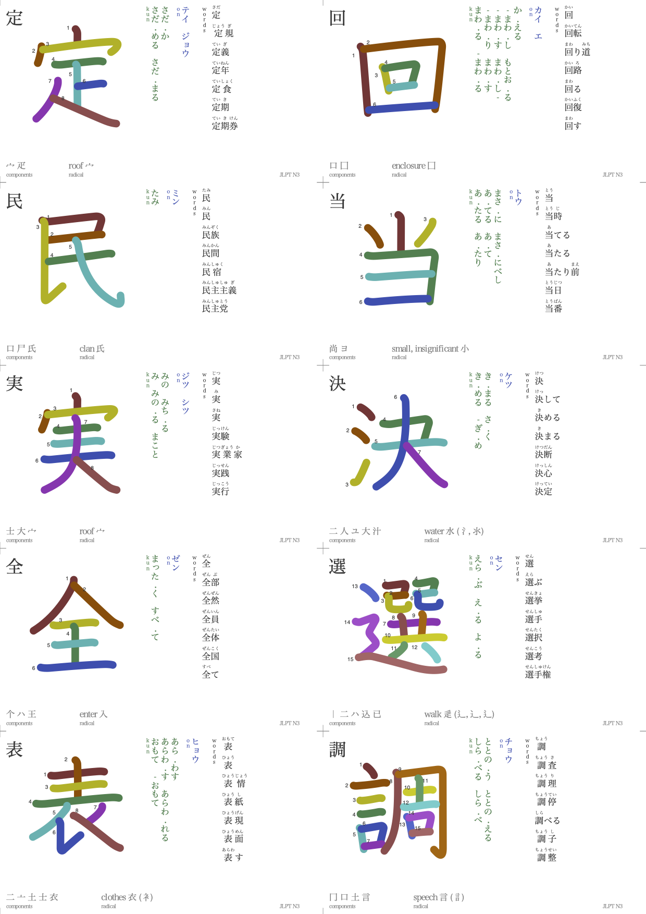
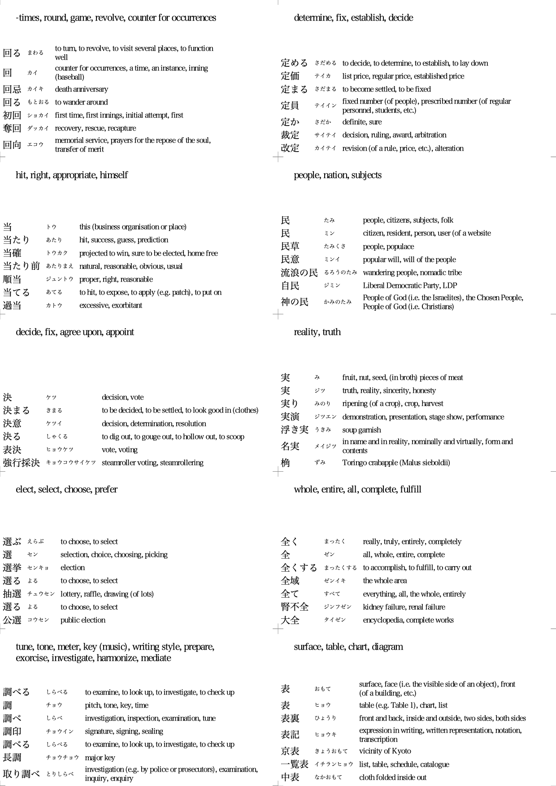
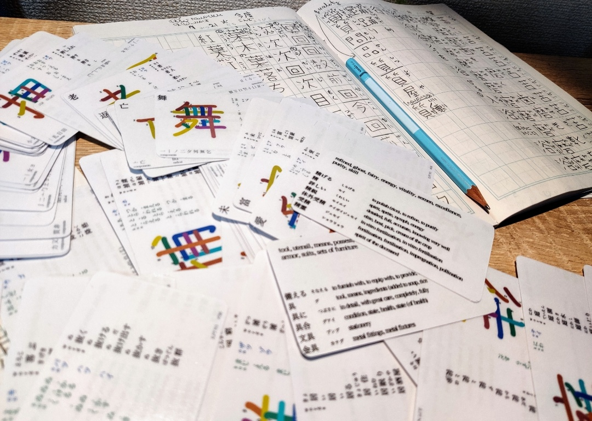

# Japanese Kanji Flipcards





## Generator script
```shell script
PYTHONPATH=$PYTHONPATH:$(pwd) python3 generate --jlpt all
```

## Printable PDF files

## All cards in a single file
  - [All JLPT levels, printable A4 page size](pdf/printable_A4_all.pdf)

## By JLPT level
  - [Extra characters from 2500 most popular Kanji not included in JLPT, printable A4 page size](pdf/printable_A4_extra.pdf)
  - [JLPT N1, printable A4 page size](pdf/printable_A4_N1.pdf)
  - [JLPT N2, printable A4 page size](pdf/printable_A4_N2.pdf)
  - [JLPT N3, printable A4 page size](pdf/printable_A4_N3.pdf)
  - [JLPT N4, printable A4 page size](pdf/printable_A4_N4.pdf)
  - [JLPT N5, printable A4 page size](pdf/printable_A4_N5.pdf)
